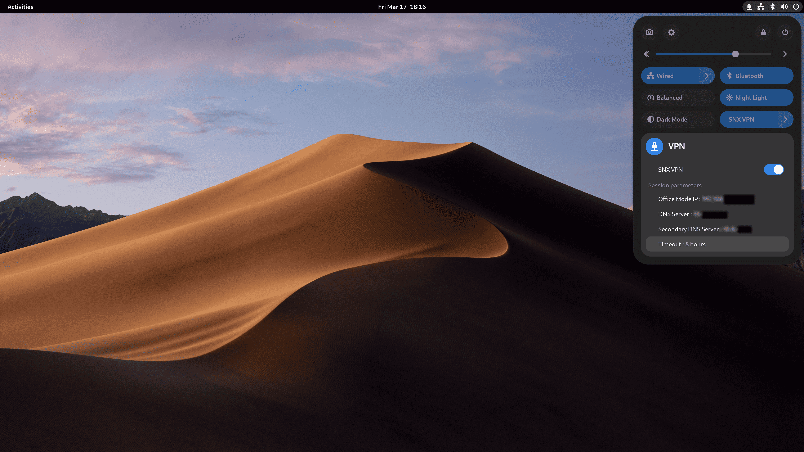

# GNOME Shell Extension - SNX VPN Indicator

[](https://www.gnu.org/licenses/gpl-3.0)




## With this extension, you can use the VPN functionality of the SSL Network Extender (SNX CLI) client directly from the Quick Settings.

### Quick settings is a new user-interface pattern for the GNOME Shell [System Menu](https://help.gnome.org/users/gnome-help/stable/shell-introduction.html#systemmenu), available in GNOME 43 and later.

---

## Installation

[](https://extensions.gnome.org/extension/5808/snx-vpn-indicator)

Manual installation

1. Clone this repo

```
git clone https://github.com/diegodario88/vpn-snx-indicator.git
```

2. Run install script

```
./scripts/install.sh
```

### Dependencies

-  You should have The SNX client in order to get it to work.
    - [Here](https://gist.github.com/rkueny/301f7ead21ed2a0ee8bbe2d755bed90b) you can find a gist that may help you with it .
    - You should have the `.snxrc` in your home directory [here is one example](examples/SNXRC.md)

<br>

- You need [expect](https://linux.die.net/man/1/expect) for this extension to work. This was the only way I found to spawn the `/usr/bin/snx` binary.

  - Fedora

    ```bash
    sudo dnf install expect
    ```

  - Arch Linux

    ```bash
    sudo pacman -S expect
    ```

  - Ubuntu/Debian

    ```bash
    sudo apt install expect
    ```

  - openSUSE

    ```bash
    sudo zypper install expect
    ```
---


## Like this Extension?

If you want to help me with this, consider buying me a coffee. :)

[](https://ko-fi.com/Y8Y8Q12UV)

Made with ❤️
